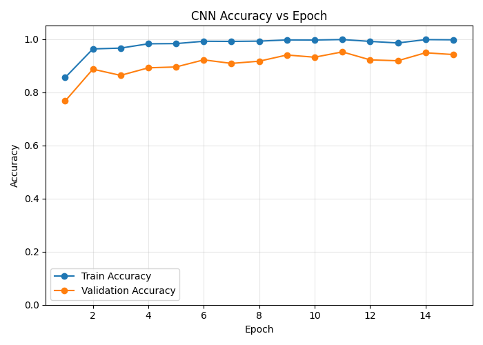
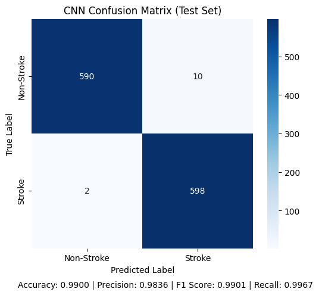
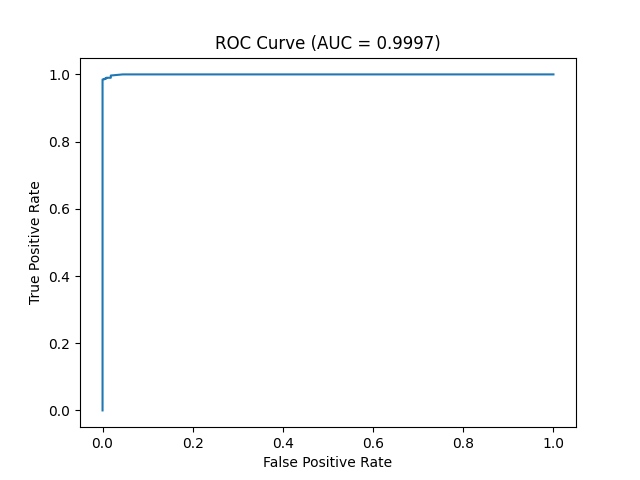
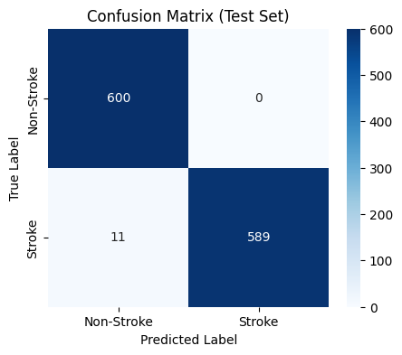
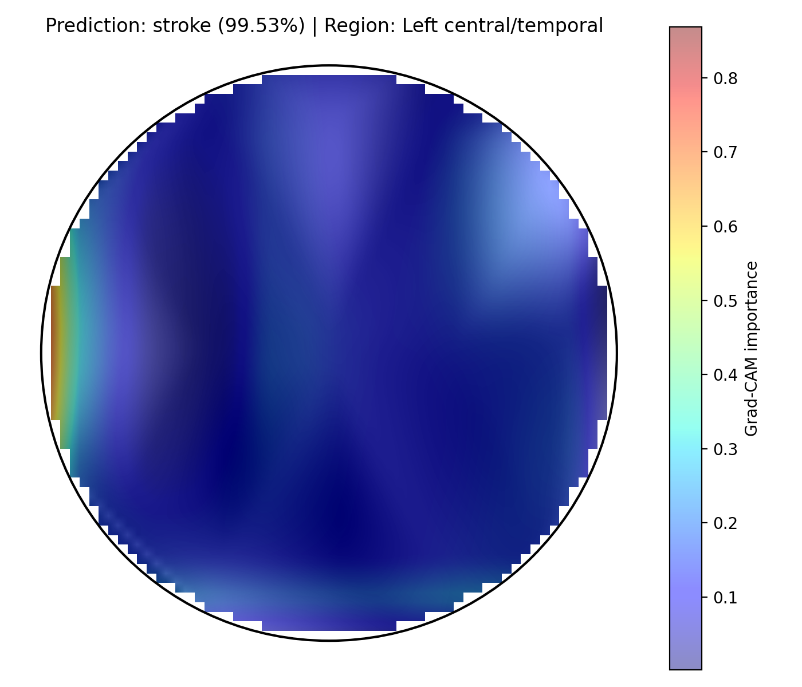

# EEG Stroke Detection and Localization

An end-to-end EEG analysis pipeline for stroke detection and approximate affected-region localization. The project preprocesses EDF recordings, extracts frequency-domain EEG features, trains classical and deep learning classifiers, generates scalp topomap representations, and uses Grad-CAM to visualize the regions that influence CNN predictions.

## Project Overview

This repository contains a complete workflow for binary EEG classification:

- **Input:** raw `.edf` EEG recordings for stroke and non-stroke subjects.
- **Preprocessing:** channel cleanup, channel selection, montage assignment, resampling to 160 Hz, and 0.5-40 Hz band-pass filtering with MNE.
- **Feature extraction:** delta, theta, alpha, and beta band power per EEG channel.
- **Detection models:** SVM on band-power features, CNN on topomap images, and CNN-LSTM on subject-level topomap sequences.
- **Localization:** Grad-CAM overlays on topomap representations with an approximate left/right and anatomical-region estimate.
- **Outputs:** trained models, confusion matrices, ROC curves, accuracy plots, sample topomaps, and localization visualizations.

## Repository Structure

```text
.
|-- config.py                         # Shared paths, channel order, electrode setup
|-- data_preprocessing.py             # Builds feature arrays and segment-level topomap data
|-- detect_n_locate.py                # Runs SVM, CNN, and Grad-CAM workflow
|-- electrodes.tsv                    # Custom electrode coordinates
|-- requirements.txt                  # Python dependencies
|-- data/
|   |-- raw/
|   |   |-- stroke/                   # Raw stroke-subject EDF files
|   |   `-- non_stroke/               # Raw non-stroke-subject EDF files
|   |-- X_*_features.npy              # Saved band-power feature splits
|   |-- y_*.npy                       # Saved labels
|   |-- topomap/                      # Segment-level topomap arrays for CNN
|   `-- topomap_sequence/             # Subject-level topomap sequences for CNN-LSTM
|-- src/
|   |-- preprocessing.py              # EDF loading, filtering, montage, resampling
|   |-- features.py                   # Segmentation and band-power feature extraction
|   |-- topomap.py                    # Topomap array generation
|   |-- dataset_utils.py              # Subject splitting and dataset helpers
|   |-- models.py                     # CNN and CNN-LSTM architectures
|   |-- svm.py                        # SVM training and evaluation
|   |-- train_cnn.py                  # CNN training and evaluation
|   |-- train_cnn_lstm.py             # CNN-LSTM sequence training
|   |-- localization.py               # Grad-CAM localization
|   `-- evaluate_subject_level.py     # Subject-level CNN majority-vote evaluation
`-- outputs/
    |-- svm/                          # SVM plots and metrics
    |-- cnn/                          # CNN plots and metrics
    |-- cnn_lstm/                     # CNN-LSTM plots and metrics
    |-- locate/                       # Grad-CAM localization overlays
    `-- trained_models/               # Saved SVM, CNN, and CNN-LSTM models
```

## Methodology

### 1. EEG Preprocessing

Raw EDF recordings are loaded with MNE. The pipeline:

1. Removes a `time` channel if present.
2. Normalizes channel names by removing dots and uppercasing labels.
3. Selects the configured 26 EEG channels from `config.py`.
4. Applies the custom montage from `electrodes.tsv`.
5. Resamples recordings to 160 Hz.
6. Applies a 0.5-40 Hz band-pass filter.

### 2. Feature Extraction

Signals are split into 2-second windows with a 1-second step. For each segment, Welch PSD is used to compute average power in four EEG bands:

- Delta: 0.5-4 Hz
- Theta: 4-8 Hz
- Alpha: 8-13 Hz
- Beta: 13-30 Hz

With 26 channels and 4 bands, each segment produces 104 numerical features.

### 3. Topomap Generation

Band-power features are reshaped into four band maps and interpolated across electrode positions to create `4 x 64 x 64` topomap tensors. These are used as CNN inputs and as ordered subject sequences for CNN-LSTM training.

### 4. Stroke Detection

The repository includes three detection approaches:

- **SVM:** `StandardScaler` + `SelectKBest` + RBF SVM with grid search and stratified cross-validation.
- **CNN:** convolutional binary classifier trained on segment-level topomap tensors.
- **CNN-LSTM:** CNN feature extractor followed by an LSTM for subject-level topomap sequences.

### 5. Localization

The localization step loads the trained CNN, applies Grad-CAM to topomap segments, averages the activation maps across a subject, and estimates the most activated scalp region as left, right, or midline plus frontal, central/temporal, or posterior/occipital.

## Setup

Create and activate a virtual environment:

```bash
python -m venv .venv
.venv\Scripts\activate
```

Install dependencies:

```bash
pip install -r requirements.txt
```

For Linux/macOS activation, use:

```bash
source .venv/bin/activate
```

## Usage

Run the preprocessing pipeline to create feature arrays and CNN topomap data:

```bash
python data_preprocessing.py
```

Train and evaluate the SVM:

```bash
python src/svm.py
```

Train and evaluate the CNN:

```bash
python -m src.train_cnn
```

Build subject-level topomap sequences for CNN-LSTM and localization:

```bash
python -m src.build_topomap_sequences --clean
```

Train the CNN-LSTM:

```bash
python -m src.train_cnn_lstm
```

Evaluate the CNN at subject level using majority vote:

```bash
python -m src.evaluate_subject_level
```

Run Grad-CAM localization:

```bash
python -m src.localization
```

Run the combined detection and localization workflow:

```bash
python detect_n_locate.py
```

## Example Outputs

The repository includes generated visual outputs under `outputs/`.

### CNN Training





### SVM Evaluation





### Grad-CAM Localization



## Data and Model Artifacts

The current project includes raw EDF recordings, processed NumPy arrays, trained model files, and generated evaluation figures. If you regenerate any derived artifacts, the important output locations are:

- `data/X_train_features.npy`, `data/X_val_features.npy`, `data/X_test_features.npy`
- `data/y_train.npy`, `data/y_val.npy`, `data/y_test.npy`
- `data/topomap/`
- `data/topomap_sequence/`
- `outputs/trained_models/svm/final_svm_model.pkl`
- `outputs/trained_models/cnn/cnn_model.pth`
- `outputs/trained_models/cnn_lstm/cnn_lstm_model.pth`

## Notes

- This project is intended for research and educational use.
- Model outputs should not be interpreted as clinical diagnoses.
- The train/validation/test splits are subject-wise and seeded for reproducibility where supported.
- Large data and model artifacts can make the repository heavy. For future public releases, consider moving raw recordings and trained weights to GitHub Releases, Git LFS, or an external dataset store.

## Tech Stack

- Python
- MNE
- NumPy and SciPy
- scikit-learn
- PyTorch
- Matplotlib and Seaborn
